```python
import pandas as pd
import seaborn as sns
import warnings
warnings.filterwarnings("ignore")

import matplotlib.pyplot as plt
%matplotlib inline
plt.rcParams["figure.figsize"] = (14,7)
```

# 1- Examine the distribution and importance of key variables including visual and statistical analysis.

## We will begin by importing the data into a pandas data frame and examining the data


```python
df = pd.read_csv("Telecom-Usage-Details.csv")
df.columns
```


    Index(['customerID', 'gender', 'SeniorCitizen', 'Partner', 'Dependents',
           'tenure', 'PhoneService', 'MultipleLines', 'InternetService',
           'OnlineSecurity', 'OnlineBackup', 'DeviceProtection', 'TechSupport',
           'StreamingTV', 'StreamingMovies', 'Contract', 'PaperlessBilling',
           'PaymentMethod', 'MonthlyCharges', 'TotalCharges', 'Churn'],
          dtype='object')


```python
df.info()
```

    <class 'pandas.core.frame.DataFrame'>
    RangeIndex: 7043 entries, 0 to 7042
    Data columns (total 21 columns):
     #   Column            Non-Null Count  Dtype  
    ---  ------            --------------  -----  
     0   customerID        7043 non-null   object 
     1   gender            7043 non-null   object 
     2   SeniorCitizen     7043 non-null   int64  
     3   Partner           7043 non-null   object 
     4   Dependents        7043 non-null   object 
     5   tenure            7043 non-null   int64  
     6   PhoneService      7043 non-null   object 
     7   MultipleLines     7043 non-null   object 
     8   InternetService   7043 non-null   object 
     9   OnlineSecurity    7043 non-null   object 
     10  OnlineBackup      7043 non-null   object 
     11  DeviceProtection  7043 non-null   object 
     12  TechSupport       7043 non-null   object 
     13  StreamingTV       7043 non-null   object 
     14  StreamingMovies   7043 non-null   object 
     15  Contract          7043 non-null   object 
     16  PaperlessBilling  7043 non-null   object 
     17  PaymentMethod     7043 non-null   object 
     18  MonthlyCharges    7043 non-null   float64
     19  TotalCharges      7043 non-null   object 
     20  Churn             7043 non-null   object 
    dtypes: float64(1), int64(2), object(18)
    memory usage: 1.1+ MB


### We notice somethings here:
1. SeniorCitizen Column has the Dtype of int64 although it's a categorical variable
2. TotalCharges values are not numerical

We will start analyzing the data and fixing these issues.

In the TotalCharges some records are " ", we will replace them with 0 and change the column to numeric values.

In the SeniorCitizen column we will replace 1 values with "yes" and 0 values with "no".


```python
replace_empty_with_0 = lambda x: "0" if x[0] ==" " else x
df.TotalCharges = df.TotalCharges.apply(replace_empty_with_0)
df.TotalCharges = pd.to_numeric(df.TotalCharges)

encode_SeniorCitizen = lambda x: "yes" if x ==1 else "no"
df.SeniorCitizen = df.SeniorCitizen.apply(encode_SeniorCitizen)
```


```python
df.describe()
```


<div>
<style scoped>
    .dataframe tbody tr th:only-of-type {
        vertical-align: middle;
    }

    .dataframe tbody tr th {
        vertical-align: top;
    }

    .dataframe thead th {
        text-align: right;
    }
</style>
<table border="1" class="dataframe">
  <thead>
    <tr style="text-align: right;">
      <th></th>
      <th>tenure</th>
      <th>MonthlyCharges</th>
      <th>TotalCharges</th>
    </tr>
  </thead>
  <tbody>
    <tr>
      <th>count</th>
      <td>7043.000000</td>
      <td>7043.000000</td>
      <td>7043.000000</td>
    </tr>
    <tr>
      <th>mean</th>
      <td>32.371149</td>
      <td>64.761692</td>
      <td>2279.734304</td>
    </tr>
    <tr>
      <th>std</th>
      <td>24.559481</td>
      <td>30.090047</td>
      <td>2266.794470</td>
    </tr>
    <tr>
      <th>min</th>
      <td>0.000000</td>
      <td>18.250000</td>
      <td>0.000000</td>
    </tr>
    <tr>
      <th>25%</th>
      <td>9.000000</td>
      <td>35.500000</td>
      <td>398.550000</td>
    </tr>
    <tr>
      <th>50%</th>
      <td>29.000000</td>
      <td>70.350000</td>
      <td>1394.550000</td>
    </tr>
    <tr>
      <th>75%</th>
      <td>55.000000</td>
      <td>89.850000</td>
      <td>3786.600000</td>
    </tr>
    <tr>
      <th>max</th>
      <td>72.000000</td>
      <td>118.750000</td>
      <td>8684.800000</td>
    </tr>
  </tbody>
</table>
</div>


#### Now all the features are the correct type, we will then make sure that we don't have any duplicate customerID or any duplicate values


```python
df = df.dropna()
len(df.customerID.value_counts())
```


    7043


#### Good! that matches the counts above our data is in good shape. We will start analyzing.


```python
sns.countplot(x="gender", data=df)
```


    <matplotlib.axes._subplots.AxesSubplot at 0x7fd84d38d250>


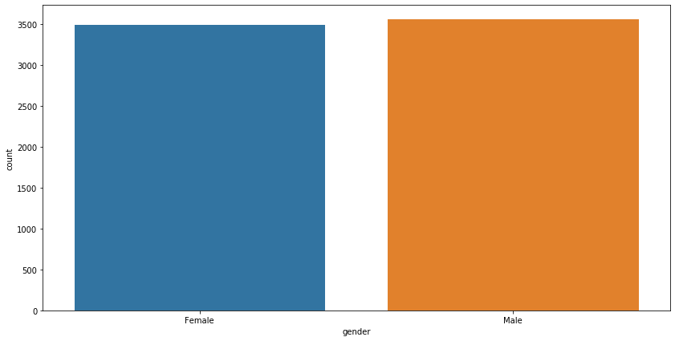


#### We have more or less equal distribution of male and female


```python
sns.countplot(x="SeniorCitizen", data=df)
```


    <matplotlib.axes._subplots.AxesSubplot at 0x7fd84b44ac50>


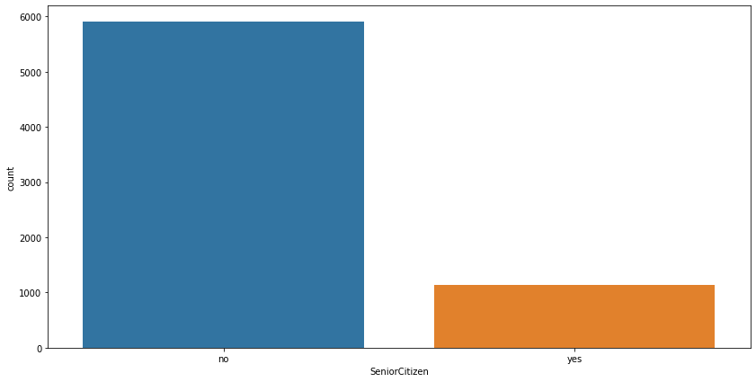


#### Only a minority of our customers are senior citizens.


```python
sns.countplot(x="gender", hue="SeniorCitizen", data=df)
```


    <matplotlib.axes._subplots.AxesSubplot at 0x7fd84cfea150>


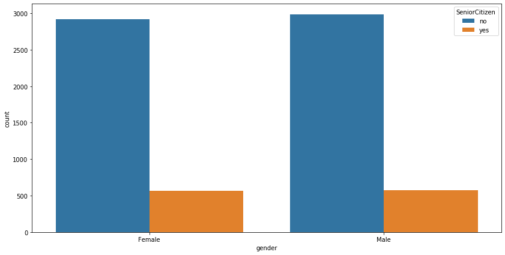


#### but we have the same distribution of ages across male and female customers


```python
sns.countplot(x="Dependents", data= df)
```


    <matplotlib.axes._subplots.AxesSubplot at 0x7fd84b38b190>


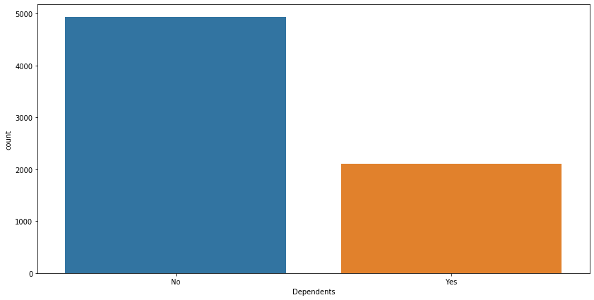


#### We have more customers with no dependents than without


```python
sns.countplot(x="gender", hue="Dependents", data=df)
```


    <matplotlib.axes._subplots.AxesSubplot at 0x7fd84b2dda90>


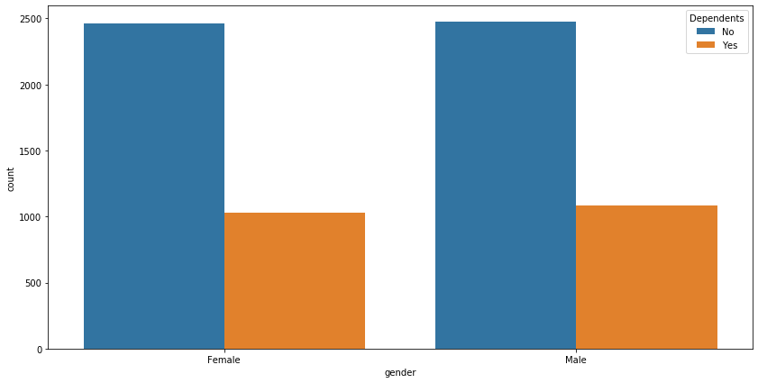


#### But again across the genders the distribution is equal.


```python
sns.countplot(x="SeniorCitizen", hue="Dependents", data=df)
```


    <matplotlib.axes._subplots.AxesSubplot at 0x7fd84b256910>


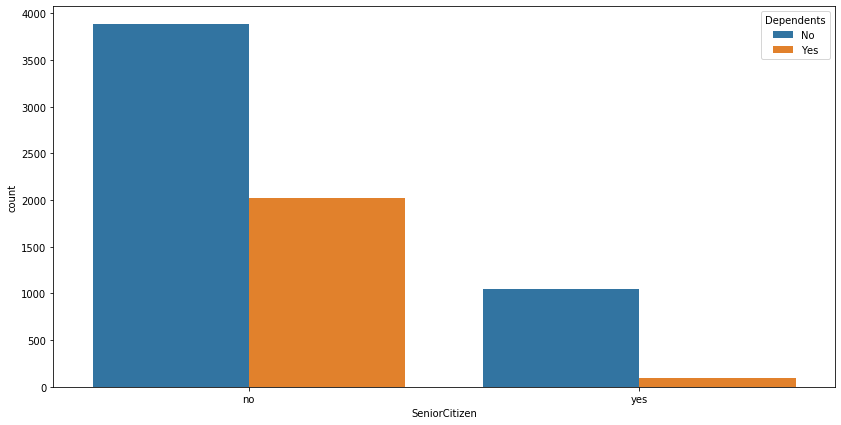


#### We notice here that nonsenior citizens are more likely to have dependents.

### Now that we have a good understanding if the demographic data of our customers we will start looking at the services they use


```python
df_services = df.iloc[:,6:14]
df_services
```


<div>
<style scoped>
    .dataframe tbody tr th:only-of-type {
        vertical-align: middle;
    }

    .dataframe tbody tr th {
        vertical-align: top;
    }

    .dataframe thead th {
        text-align: right;
    }
</style>
<table border="1" class="dataframe">
  <thead>
    <tr style="text-align: right;">
      <th></th>
      <th>PhoneService</th>
      <th>MultipleLines</th>
      <th>InternetService</th>
      <th>OnlineSecurity</th>
      <th>OnlineBackup</th>
      <th>DeviceProtection</th>
      <th>TechSupport</th>
      <th>StreamingTV</th>
    </tr>
  </thead>
  <tbody>
    <tr>
      <th>0</th>
      <td>No</td>
      <td>No phone service</td>
      <td>DSL</td>
      <td>No</td>
      <td>Yes</td>
      <td>No</td>
      <td>No</td>
      <td>No</td>
    </tr>
    <tr>
      <th>1</th>
      <td>Yes</td>
      <td>No</td>
      <td>DSL</td>
      <td>Yes</td>
      <td>No</td>
      <td>Yes</td>
      <td>No</td>
      <td>No</td>
    </tr>
    <tr>
      <th>2</th>
      <td>Yes</td>
      <td>No</td>
      <td>DSL</td>
      <td>Yes</td>
      <td>Yes</td>
      <td>No</td>
      <td>No</td>
      <td>No</td>
    </tr>
    <tr>
      <th>3</th>
      <td>No</td>
      <td>No phone service</td>
      <td>DSL</td>
      <td>Yes</td>
      <td>No</td>
      <td>Yes</td>
      <td>Yes</td>
      <td>No</td>
    </tr>
    <tr>
      <th>4</th>
      <td>Yes</td>
      <td>No</td>
      <td>Fiber optic</td>
      <td>No</td>
      <td>No</td>
      <td>No</td>
      <td>No</td>
      <td>No</td>
    </tr>
    <tr>
      <th>...</th>
      <td>...</td>
      <td>...</td>
      <td>...</td>
      <td>...</td>
      <td>...</td>
      <td>...</td>
      <td>...</td>
      <td>...</td>
    </tr>
    <tr>
      <th>7038</th>
      <td>Yes</td>
      <td>Yes</td>
      <td>DSL</td>
      <td>Yes</td>
      <td>No</td>
      <td>Yes</td>
      <td>Yes</td>
      <td>Yes</td>
    </tr>
    <tr>
      <th>7039</th>
      <td>Yes</td>
      <td>Yes</td>
      <td>Fiber optic</td>
      <td>No</td>
      <td>Yes</td>
      <td>Yes</td>
      <td>No</td>
      <td>Yes</td>
    </tr>
    <tr>
      <th>7040</th>
      <td>No</td>
      <td>No phone service</td>
      <td>DSL</td>
      <td>Yes</td>
      <td>No</td>
      <td>No</td>
      <td>No</td>
      <td>No</td>
    </tr>
    <tr>
      <th>7041</th>
      <td>Yes</td>
      <td>Yes</td>
      <td>Fiber optic</td>
      <td>No</td>
      <td>No</td>
      <td>No</td>
      <td>No</td>
      <td>No</td>
    </tr>
    <tr>
      <th>7042</th>
      <td>Yes</td>
      <td>No</td>
      <td>Fiber optic</td>
      <td>Yes</td>
      <td>No</td>
      <td>Yes</td>
      <td>Yes</td>
      <td>Yes</td>
    </tr>
  </tbody>
</table>
<p>7043 rows × 8 columns</p>
</div>


```python
sns.countplot(x="PhoneService", hue="MultipleLines", data=df)
```


    <matplotlib.axes._subplots.AxesSubplot at 0x7fd84b1cab10>


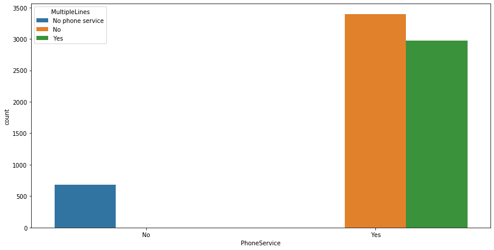


#### Most of our customers have phone service and a good percentage of them have multiple lines


```python
sns.countplot(x="InternetService", data=df)
```


    <matplotlib.axes._subplots.AxesSubplot at 0x7fd84b14fb50>


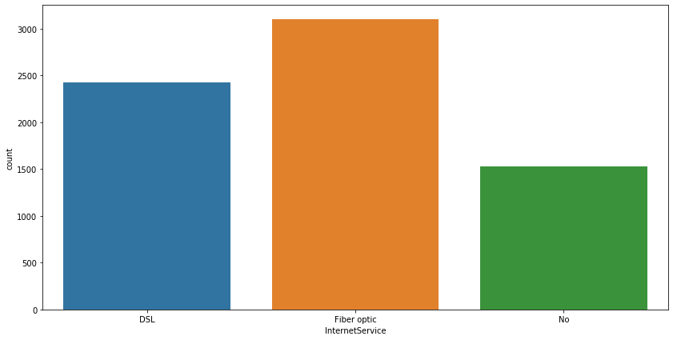


#### However, a significant number of our customers don't have internet service with us. Fiber Optic service is more popular than DSL


```python
df_services_no_internet = df_services[df_services.InternetService == "No"]
sns.countplot(x="PhoneService", hue="MultipleLines", data=df_services_no_internet)
```


    <matplotlib.axes._subplots.AxesSubplot at 0x7fd84b0a69d0>


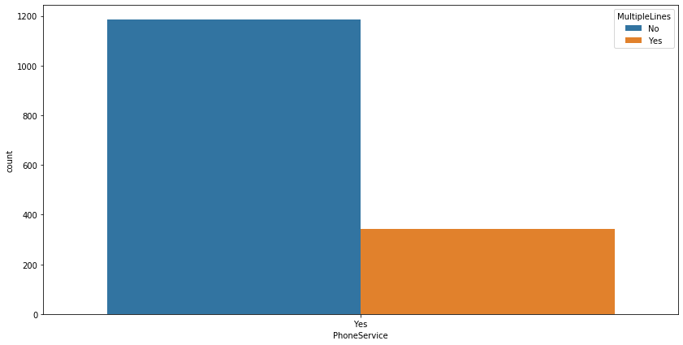


#### Our customers with no internet service mostly have single lines meaning they are likely to be low-value customers


```python
df_internet = df_services[df_services.InternetService != "No"]
sns.countplot(x="InternetService", hue="OnlineSecurity", data=df_internet)
```


    <matplotlib.axes._subplots.AxesSubplot at 0x7fd84b020910>


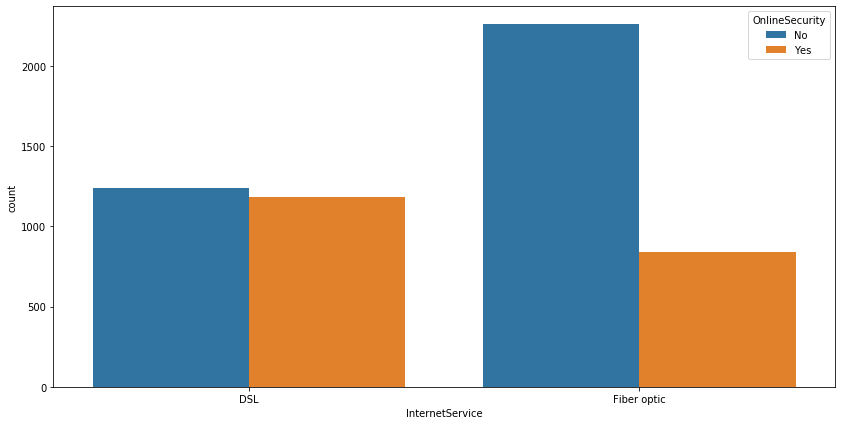


#### Our online security service is more popular with our DSL users compared to Fiber Optic users.


```python
sns.countplot(x="InternetService", hue="OnlineBackup", data=df_internet)
```


    <matplotlib.axes._subplots.AxesSubplot at 0x7fd84affad90>


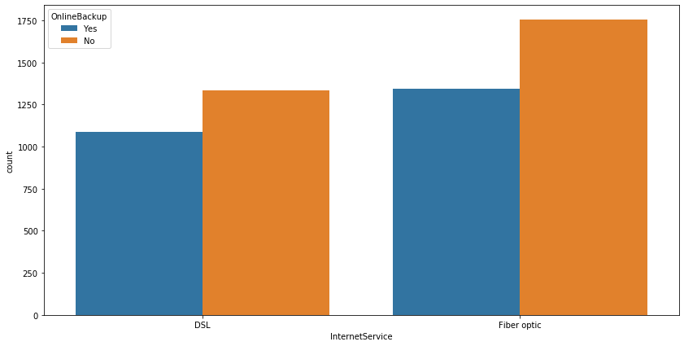


#### However our Online Backup service is more popular with Fiber optic users. Possibly because they can benefit from faster speeds


```python
sns.countplot(x="InternetService", hue="DeviceProtection", data=df_internet)
```


    <matplotlib.axes._subplots.AxesSubplot at 0x7fd84af62490>


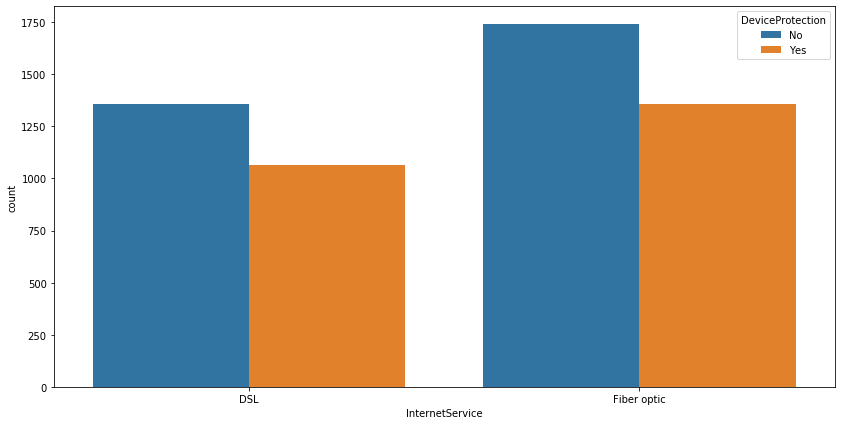


#### similar subsets of our customers buy the device protection service across DSL and Fiber optic


```python
sns.countplot(x="InternetService", hue="TechSupport", data=df_internet)
```


    <matplotlib.axes._subplots.AxesSubplot at 0x7fd84af4bc90>


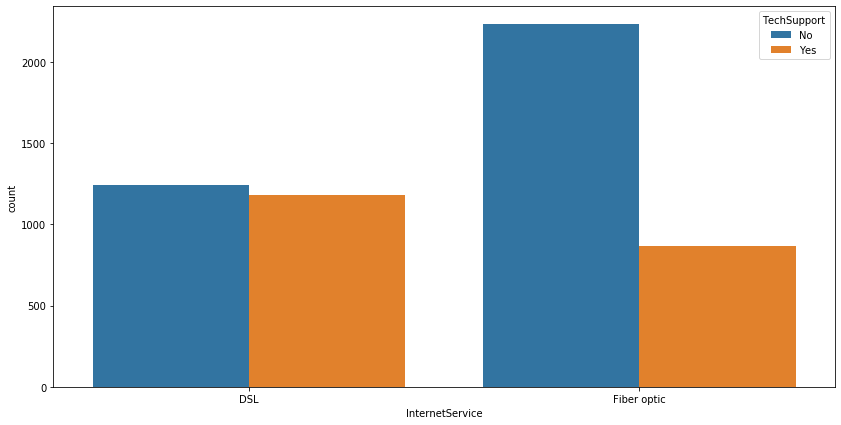


#### The tech support service is much more popular with DSL customers. Possibly because fiber optic customers are more advanced users


```python
sns.countplot(x="InternetService", hue="StreamingTV", data=df_internet)
```


    <matplotlib.axes._subplots.AxesSubplot at 0x7fd84aeb8bd0>


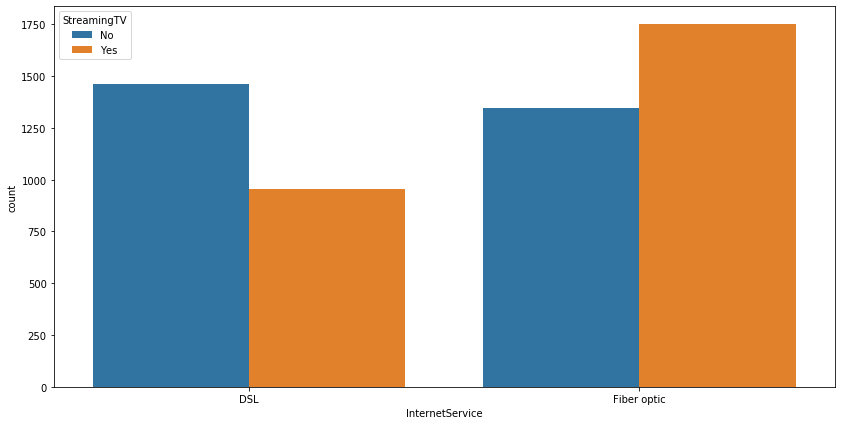


#### Again Streaming is popular with optic fiber users possibly because of the faster internet speeds


```python
sns.countplot(x="Contract", data=df)
```


    <matplotlib.axes._subplots.AxesSubplot at 0x7fd84ae2a790>


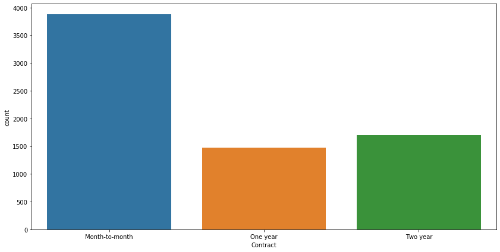


#### A significant portion of our customers are month-to-month customers. this is risky because they can cancel their service without breaching a contract


```python
sns.countplot("PaymentMethod", data=df)
```


    <matplotlib.axes._subplots.AxesSubplot at 0x7fd84ae17090>


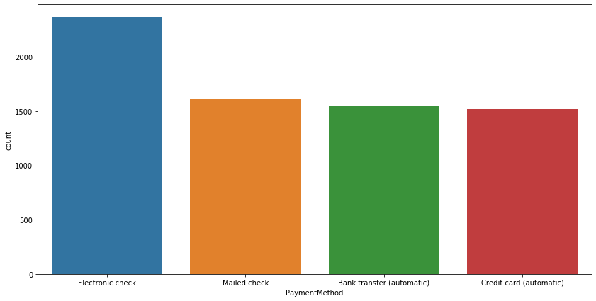


#### There's an oppurtinuty here to convert customers using electronic or mailed checks to an automatic payment method


```python
sns.countplot("Churn", data= df)
```


    <matplotlib.axes._subplots.AxesSubplot at 0x7fd84ae34b50>


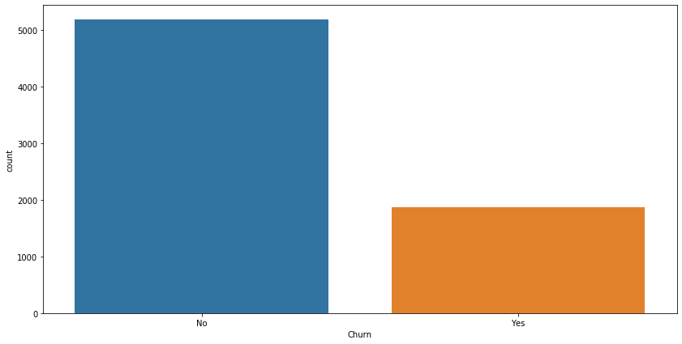


#### This is the distribution of customers from the prespective of churn


```python
sns.boxplot(y="tenure", x="Churn", data=df)
```


    <matplotlib.axes._subplots.AxesSubplot at 0x7fd84ad4f890>


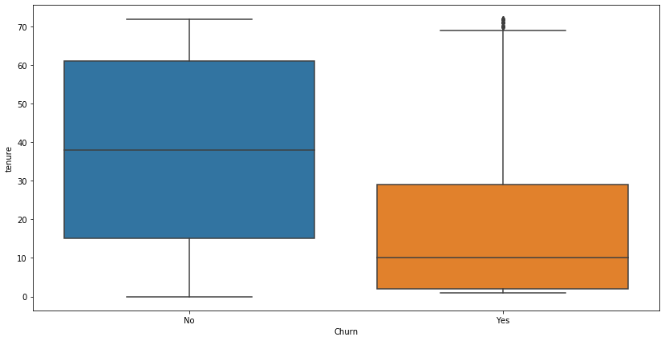


#### newer customers are more likely to churn


```python
sns.boxplot(y="TotalCharges", x="Churn", data=df)
```


    <matplotlib.axes._subplots.AxesSubplot at 0x7fd84acd6e90>


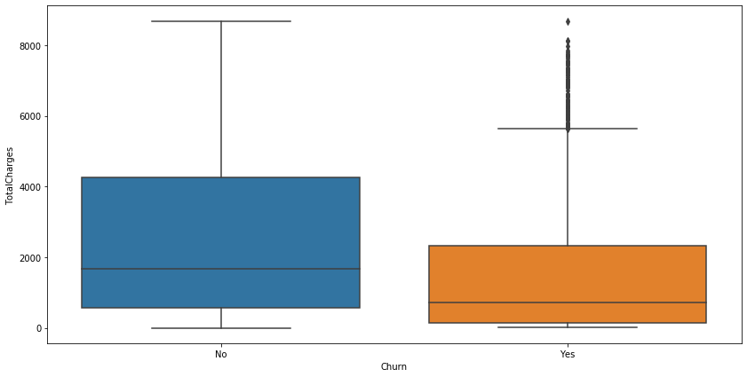


#### and lower value customers are more likely to churn. It's rare for our high-valued customers to churn since they are represented as outliers


```python
sns.scatterplot(x = "tenure", y="TotalCharges", hue="Churn", data=df)
```


    <matplotlib.axes._subplots.AxesSubplot at 0x7fd84ac46950>


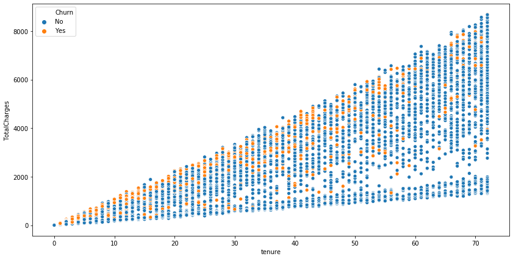


#### This is the relatuinship between tenure and Totalcharges. We see that our lower valued customers are more likely to churn. less tenured customers are also likely to churn more.


```python
sns.countplot(x="MultipleLines", hue="Churn", data=df)
```


    <matplotlib.axes._subplots.AxesSubplot at 0x7fd84ab6ed50>


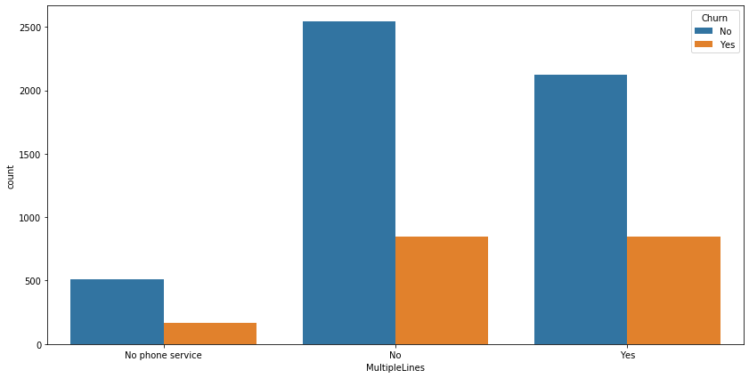


#### It doesn't appear that the type of phone service is significantly correlated to churn.


```python
sns.countplot(x="InternetService", hue="Churn", data=df)
```


    <matplotlib.axes._subplots.AxesSubplot at 0x7fd84ab19b10>


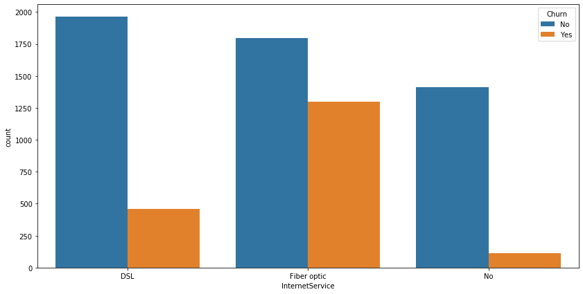


### This graph is very informative. First of all, we see that our fiber optic customers are unsatisfied and likely to churn. we also see that our phone only customers are more satisfied and unlikely to churn

## Suppose we call 'OnlineSecurity', 'OnlineBackup', 'DeviceProtection', 'TechSupport','StreamingTV', 'StreamingMovies' Add on internet services
We will calculate the number of add-on services each customer has and study the relationship between that and the churn


```python
df_addon = df[['OnlineSecurity', 'OnlineBackup', 'DeviceProtection', 'TechSupport','StreamingTV', 'StreamingMovies']]
service_counter = lambda x: 1 if x =="Yes" else 0

df_addon = df_addon.applymap(service_counter)
```


```python
import numpy as np
n_of_addon_services = np.sum(np.asarray(df_addon),axis=1)
df["n_of_addon_services"] = n_of_addon_services
```


```python
sns.countplot(x="n_of_addon_services", hue="Churn", data=df)
```


    <matplotlib.axes._subplots.AxesSubplot at 0x7fd84926cf10>


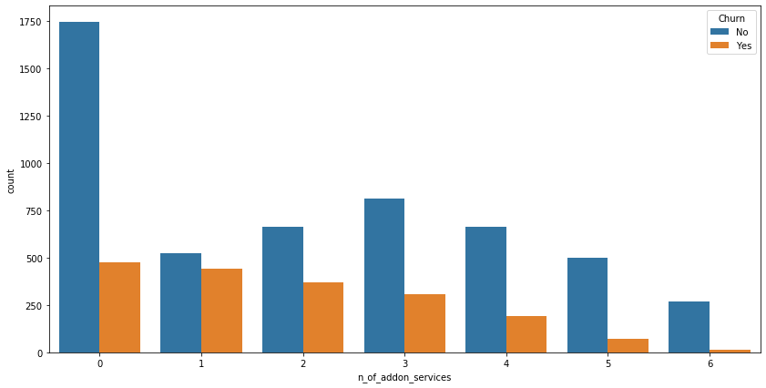


## we see that the more services our custoner has, the less likely they are to leave.

# 2- Find out the best way to segment customers using K-means based on the Tenure and Total Charges variables in the dataset


```python
from sklearn.cluster import KMeans
from sklearn.preprocessing import StandardScaler

X = df[["tenure", "TotalCharges"]]
y = df["customerID"]

scaler = StandardScaler()
X_scaled = scaler.fit_transform(X)

sns.scatterplot(X_scaled[:,0], X_scaled[:,1])
```


    <matplotlib.axes._subplots.AxesSubplot at 0x7fd8487776d0>


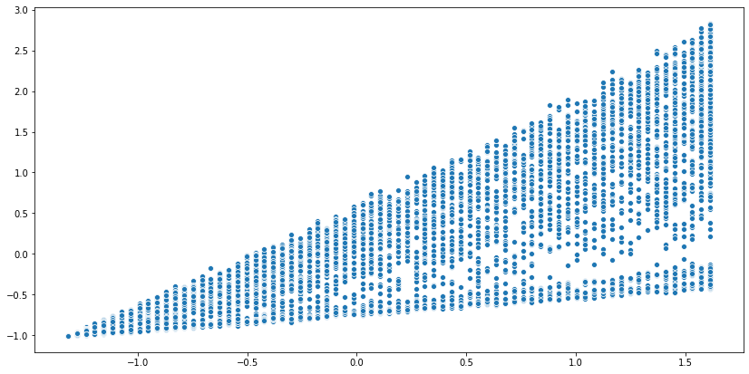


We begin by scaling Customer tenurity on the x-axis and customer total charges on the y-axis so our clustering could run more efficiently

### To find the optimal number of clusters we will use the elbow method
we will plot the within cluster square sum of distance for each number of clusters


```python
WCSS = []
for i in range(1,11):
    model = KMeans(n_clusters=i,random_state=0)
    model.fit(X_scaled)
    WCSS.append(model.inertia_)
sns.lineplot(range(1,11), WCSS)
```


    <matplotlib.axes._subplots.AxesSubplot at 0x7fd84860eed0>


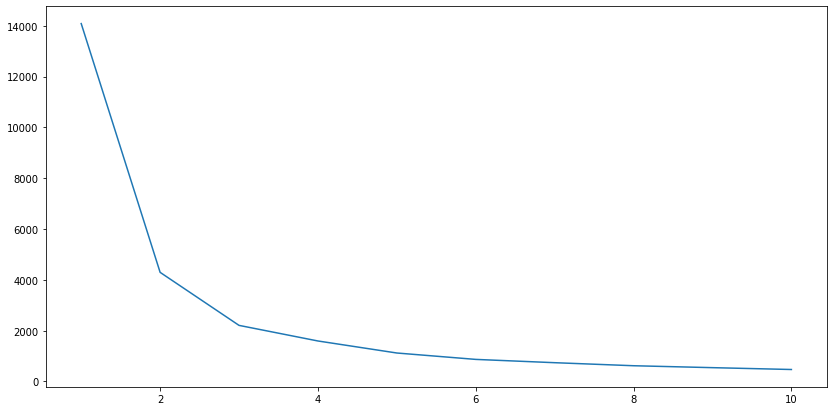


### We will try 3, 4, 6 and 10 clusters


```python
model_3 = KMeans(n_clusters=3, init="k-means++")
y = model_3.fit_predict(X_scaled)
sns.scatterplot(x = "tenure", y="TotalCharges", hue=y, data=df)
```


    <matplotlib.axes._subplots.AxesSubplot at 0x7fd8481a1850>


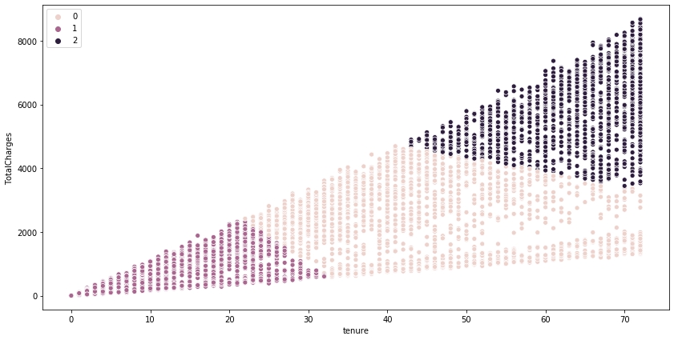


```python
model_4 = KMeans(n_clusters=4, init="k-means++")
y = model_4.fit_predict(X_scaled)
sns.scatterplot(x = "tenure", y="TotalCharges", hue=y, data=df)
```


    <matplotlib.axes._subplots.AxesSubplot at 0x7fd848115610>


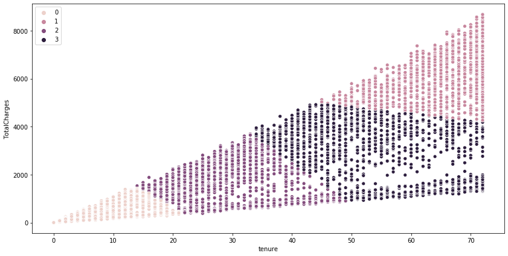


```python
model_6 = KMeans(n_clusters=6, init="k-means++")
y = model_6.fit_predict(X_scaled)
sns.scatterplot(x = "tenure", y="TotalCharges", hue=y, data=df,legend="full", palette="muted")
```


    <matplotlib.axes._subplots.AxesSubplot at 0x7fd8436bba90>


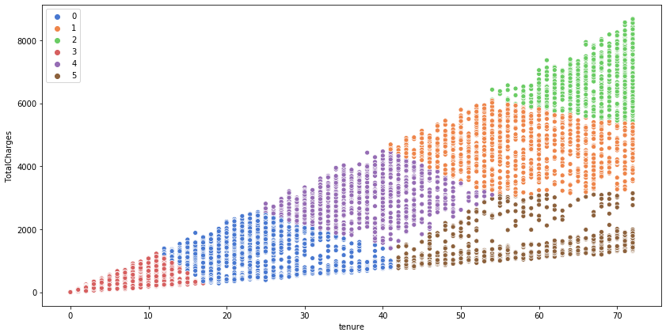


```python
model_10 = KMeans(n_clusters=10, init="k-means++")
y = model_10.fit_predict(X_scaled)
sns.scatterplot(x = "tenure", y="TotalCharges", hue=y, data=df,legend="full", palette="muted")
```


    <matplotlib.axes._subplots.AxesSubplot at 0x7f20e7589750>


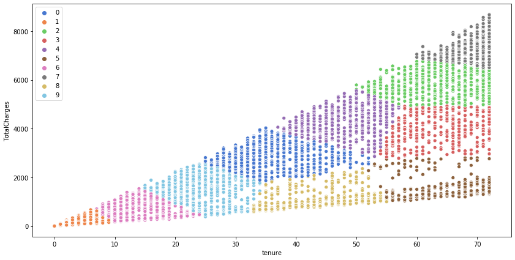


### In my opinion 6 clusters is the most logical option
The six clusters provide a good indication of customer's tenurity vs. their value we will begin applying labels to these clusters and we will analyze more


```python
model_6 = KMeans(n_clusters=6, init="k-means++")
y = model_6.fit_predict(X_scaled)
sns.scatterplot(x = "tenure", y="TotalCharges", hue=y, data=df,legend="full", palette="muted")
```


    <matplotlib.axes._subplots.AxesSubplot at 0x7fd84364ded0>


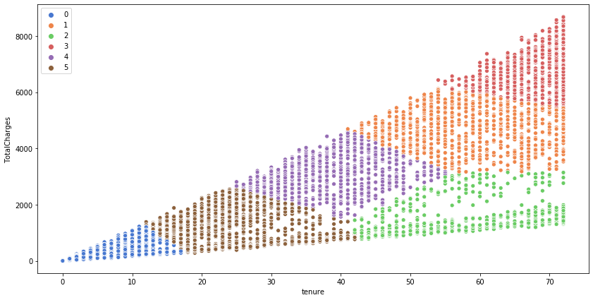


```python
my_dict = {
    0:"low Ten/low Val",
    1:"high Ten/high-int Val",
    2:"high Ten/low Val",
    3:"high Ten/High Val",
    4:"int Ten/int Val",
    5:"int Ten/low-int Val"
}

customerSegment = []
for i in y:
    customerSegment.append(my_dict[int(i)])

df["customerSegment"] = customerSegment
```


```python
sns.scatterplot(x = "tenure", y="TotalCharges", hue="customerSegment", data=df,legend="full", palette="muted")
```


    <matplotlib.axes._subplots.AxesSubplot at 0x7fd84355f750>


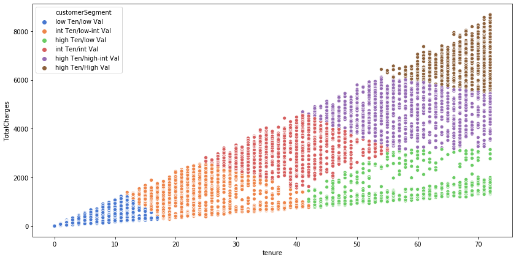


```python
sns.scatterplot(x = "tenure", y="TotalCharges", hue="customerSegment", data=df[df.Churn == "Yes"],legend="full", palette="muted")
```


    <matplotlib.axes._subplots.AxesSubplot at 0x7fd843567110>


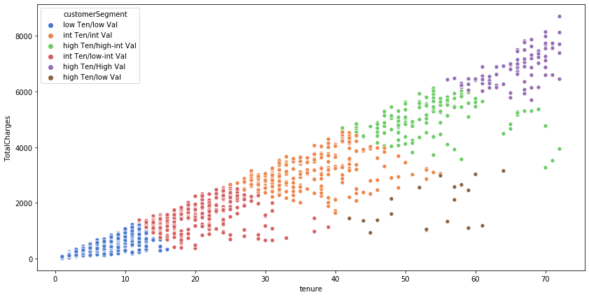


## This plot shows customers who churned and their segment
### We can see that some customer segments are more likely to churn than others


```python
df_segmented = df.groupby(['customerSegment','Churn']).agg({'customerID': 'count'})
df_segmented
```


<div>
<style scoped>
    .dataframe tbody tr th:only-of-type {
        vertical-align: middle;
    }

    .dataframe tbody tr th {
        vertical-align: top;
    }

    .dataframe thead th {
        text-align: right;
    }
</style>
<table border="1" class="dataframe">
  <thead>
    <tr style="text-align: right;">
      <th></th>
      <th></th>
      <th>customerID</th>
    </tr>
    <tr>
      <th>customerSegment</th>
      <th>Churn</th>
      <th></th>
    </tr>
  </thead>
  <tbody>
    <tr>
      <th rowspan="2" valign="top">high Ten/High Val</th>
      <th>No</th>
      <td>700</td>
    </tr>
    <tr>
      <th>Yes</th>
      <td>89</td>
    </tr>
    <tr>
      <th rowspan="2" valign="top">high Ten/high-int Val</th>
      <th>No</th>
      <td>812</td>
    </tr>
    <tr>
      <th>Yes</th>
      <td>134</td>
    </tr>
    <tr>
      <th rowspan="2" valign="top">high Ten/low Val</th>
      <th>No</th>
      <td>643</td>
    </tr>
    <tr>
      <th>Yes</th>
      <td>20</td>
    </tr>
    <tr>
      <th rowspan="2" valign="top">int Ten/int Val</th>
      <th>No</th>
      <td>633</td>
    </tr>
    <tr>
      <th>Yes</th>
      <td>233</td>
    </tr>
    <tr>
      <th rowspan="2" valign="top">int Ten/low-int Val</th>
      <th>No</th>
      <td>1076</td>
    </tr>
    <tr>
      <th>Yes</th>
      <td>335</td>
    </tr>
    <tr>
      <th rowspan="2" valign="top">low Ten/low Val</th>
      <th>No</th>
      <td>1310</td>
    </tr>
    <tr>
      <th>Yes</th>
      <td>1058</td>
    </tr>
  </tbody>
</table>
</div>


```python
calc_pct = lambda x: round(100 * x / float(x.sum()),2)
Churn_percentages =df_segmented.groupby(level=0).apply(calc_pct)
Churn_percentages
```


<div>
<style scoped>
    .dataframe tbody tr th:only-of-type {
        vertical-align: middle;
    }

    .dataframe tbody tr th {
        vertical-align: top;
    }

    .dataframe thead th {
        text-align: right;
    }
</style>
<table border="1" class="dataframe">
  <thead>
    <tr style="text-align: right;">
      <th></th>
      <th></th>
      <th>customerID</th>
    </tr>
    <tr>
      <th>customerSegment</th>
      <th>Churn</th>
      <th></th>
    </tr>
  </thead>
  <tbody>
    <tr>
      <th rowspan="2" valign="top">high Ten/High Val</th>
      <th>No</th>
      <td>88.72</td>
    </tr>
    <tr>
      <th>Yes</th>
      <td>11.28</td>
    </tr>
    <tr>
      <th rowspan="2" valign="top">high Ten/high-int Val</th>
      <th>No</th>
      <td>85.84</td>
    </tr>
    <tr>
      <th>Yes</th>
      <td>14.16</td>
    </tr>
    <tr>
      <th rowspan="2" valign="top">high Ten/low Val</th>
      <th>No</th>
      <td>96.98</td>
    </tr>
    <tr>
      <th>Yes</th>
      <td>3.02</td>
    </tr>
    <tr>
      <th rowspan="2" valign="top">int Ten/int Val</th>
      <th>No</th>
      <td>73.09</td>
    </tr>
    <tr>
      <th>Yes</th>
      <td>26.91</td>
    </tr>
    <tr>
      <th rowspan="2" valign="top">int Ten/low-int Val</th>
      <th>No</th>
      <td>76.26</td>
    </tr>
    <tr>
      <th>Yes</th>
      <td>23.74</td>
    </tr>
    <tr>
      <th rowspan="2" valign="top">low Ten/low Val</th>
      <th>No</th>
      <td>55.32</td>
    </tr>
    <tr>
      <th>Yes</th>
      <td>44.68</td>
    </tr>
  </tbody>
</table>
</div>


### We can say here that our most at risk customers are:
1. Low tenurity and low value customers (44.68% churn rate)
2. Intermediate Tenurity and Intermediate value customers (26.91% churn rate)
3. Intermediate tenurity and low-intermediate value customers (23.74% churn rate)

### Our safest customers are:
1. High tenurity and low value customers (3.02% churn rate)
2. High tenurity and High value customers (11.28% churn rate)
3. High tenurity and high-intermediate value customers (14.16% churn rate)

It follows business logic that customers with the least churn are high tenurity and low value customers (ex. a sensior citizen who has only one line and has been with the company for a long time) and that customers with the highest churn rates are low tenurity and low value customers (ex. tourists buying single lines or people buying burner phones).

it's positive that most of the churn rates are happening in intermediate to low value customers. it follows logic that customers who are deeply investing in our service are less likely to leave.

# 3- Build simple models using Logistic Regression to predict customer churn behavior based on the most important variables in the provided dataset.

## Feature Engineering


```python
df.columns
```


    Index(['customerID', 'gender', 'SeniorCitizen', 'Partner', 'Dependents',
           'tenure', 'PhoneService', 'MultipleLines', 'InternetService',
           'OnlineSecurity', 'OnlineBackup', 'DeviceProtection', 'TechSupport',
           'StreamingTV', 'StreamingMovies', 'Contract', 'PaperlessBilling',
           'PaymentMethod', 'MonthlyCharges', 'TotalCharges', 'Churn',
           'n_of_addon_services', 'customerSegment'],
          dtype='object')


```python
encoded_df = df[['gender', 'SeniorCitizen', 'Partner', 'Dependents', 'PhoneService', 'MultipleLines', 'InternetService',
       'OnlineSecurity', 'OnlineBackup', 'DeviceProtection', 'TechSupport',
       'StreamingTV', 'StreamingMovies', 'Contract', 'PaperlessBilling',
       'PaymentMethod','n_of_addon_services', 'customerSegment']]
from sklearn.preprocessing import OrdinalEncoder
ordinal_encoder = OrdinalEncoder()
encoded_array = ordinal_encoder.fit_transform(encoded_df)

from itertools import count
j = count(start=0, step = 1)
for i in encoded_df.columns:
    encoded_df[i] = encoded_array[:,next(j)]
```

### We encoded all of our categorical Features
We give the categorical features numerical values so we can plug them in the model


```python
encoded_df
```


<div>
<style scoped>
    .dataframe tbody tr th:only-of-type {
        vertical-align: middle;
    }

    .dataframe tbody tr th {
        vertical-align: top;
    }

    .dataframe thead th {
        text-align: right;
    }
</style>
<table border="1" class="dataframe">
  <thead>
    <tr style="text-align: right;">
      <th></th>
      <th>gender</th>
      <th>SeniorCitizen</th>
      <th>Partner</th>
      <th>Dependents</th>
      <th>PhoneService</th>
      <th>MultipleLines</th>
      <th>InternetService</th>
      <th>OnlineSecurity</th>
      <th>OnlineBackup</th>
      <th>DeviceProtection</th>
      <th>TechSupport</th>
      <th>StreamingTV</th>
      <th>StreamingMovies</th>
      <th>Contract</th>
      <th>PaperlessBilling</th>
      <th>PaymentMethod</th>
      <th>n_of_addon_services</th>
      <th>customerSegment</th>
    </tr>
  </thead>
  <tbody>
    <tr>
      <th>0</th>
      <td>0.0</td>
      <td>0.0</td>
      <td>1.0</td>
      <td>0.0</td>
      <td>0.0</td>
      <td>1.0</td>
      <td>0.0</td>
      <td>0.0</td>
      <td>2.0</td>
      <td>0.0</td>
      <td>0.0</td>
      <td>0.0</td>
      <td>0.0</td>
      <td>0.0</td>
      <td>1.0</td>
      <td>2.0</td>
      <td>1.0</td>
      <td>5.0</td>
    </tr>
    <tr>
      <th>1</th>
      <td>1.0</td>
      <td>0.0</td>
      <td>0.0</td>
      <td>0.0</td>
      <td>1.0</td>
      <td>0.0</td>
      <td>0.0</td>
      <td>2.0</td>
      <td>0.0</td>
      <td>2.0</td>
      <td>0.0</td>
      <td>0.0</td>
      <td>0.0</td>
      <td>1.0</td>
      <td>0.0</td>
      <td>3.0</td>
      <td>2.0</td>
      <td>4.0</td>
    </tr>
    <tr>
      <th>2</th>
      <td>1.0</td>
      <td>0.0</td>
      <td>0.0</td>
      <td>0.0</td>
      <td>1.0</td>
      <td>0.0</td>
      <td>0.0</td>
      <td>2.0</td>
      <td>2.0</td>
      <td>0.0</td>
      <td>0.0</td>
      <td>0.0</td>
      <td>0.0</td>
      <td>0.0</td>
      <td>1.0</td>
      <td>3.0</td>
      <td>2.0</td>
      <td>5.0</td>
    </tr>
    <tr>
      <th>3</th>
      <td>1.0</td>
      <td>0.0</td>
      <td>0.0</td>
      <td>0.0</td>
      <td>0.0</td>
      <td>1.0</td>
      <td>0.0</td>
      <td>2.0</td>
      <td>0.0</td>
      <td>2.0</td>
      <td>2.0</td>
      <td>0.0</td>
      <td>0.0</td>
      <td>1.0</td>
      <td>0.0</td>
      <td>0.0</td>
      <td>3.0</td>
      <td>2.0</td>
    </tr>
    <tr>
      <th>4</th>
      <td>0.0</td>
      <td>0.0</td>
      <td>0.0</td>
      <td>0.0</td>
      <td>1.0</td>
      <td>0.0</td>
      <td>1.0</td>
      <td>0.0</td>
      <td>0.0</td>
      <td>0.0</td>
      <td>0.0</td>
      <td>0.0</td>
      <td>0.0</td>
      <td>0.0</td>
      <td>1.0</td>
      <td>2.0</td>
      <td>0.0</td>
      <td>5.0</td>
    </tr>
    <tr>
      <th>...</th>
      <td>...</td>
      <td>...</td>
      <td>...</td>
      <td>...</td>
      <td>...</td>
      <td>...</td>
      <td>...</td>
      <td>...</td>
      <td>...</td>
      <td>...</td>
      <td>...</td>
      <td>...</td>
      <td>...</td>
      <td>...</td>
      <td>...</td>
      <td>...</td>
      <td>...</td>
      <td>...</td>
    </tr>
    <tr>
      <th>7038</th>
      <td>1.0</td>
      <td>0.0</td>
      <td>1.0</td>
      <td>1.0</td>
      <td>1.0</td>
      <td>2.0</td>
      <td>0.0</td>
      <td>2.0</td>
      <td>0.0</td>
      <td>2.0</td>
      <td>2.0</td>
      <td>2.0</td>
      <td>2.0</td>
      <td>1.0</td>
      <td>1.0</td>
      <td>3.0</td>
      <td>5.0</td>
      <td>4.0</td>
    </tr>
    <tr>
      <th>7039</th>
      <td>0.0</td>
      <td>0.0</td>
      <td>1.0</td>
      <td>1.0</td>
      <td>1.0</td>
      <td>2.0</td>
      <td>1.0</td>
      <td>0.0</td>
      <td>2.0</td>
      <td>2.0</td>
      <td>0.0</td>
      <td>2.0</td>
      <td>2.0</td>
      <td>1.0</td>
      <td>1.0</td>
      <td>1.0</td>
      <td>4.0</td>
      <td>0.0</td>
    </tr>
    <tr>
      <th>7040</th>
      <td>0.0</td>
      <td>0.0</td>
      <td>1.0</td>
      <td>1.0</td>
      <td>0.0</td>
      <td>1.0</td>
      <td>0.0</td>
      <td>2.0</td>
      <td>0.0</td>
      <td>0.0</td>
      <td>0.0</td>
      <td>0.0</td>
      <td>0.0</td>
      <td>0.0</td>
      <td>1.0</td>
      <td>2.0</td>
      <td>1.0</td>
      <td>5.0</td>
    </tr>
    <tr>
      <th>7041</th>
      <td>1.0</td>
      <td>1.0</td>
      <td>1.0</td>
      <td>0.0</td>
      <td>1.0</td>
      <td>2.0</td>
      <td>1.0</td>
      <td>0.0</td>
      <td>0.0</td>
      <td>0.0</td>
      <td>0.0</td>
      <td>0.0</td>
      <td>0.0</td>
      <td>0.0</td>
      <td>1.0</td>
      <td>3.0</td>
      <td>0.0</td>
      <td>5.0</td>
    </tr>
    <tr>
      <th>7042</th>
      <td>1.0</td>
      <td>0.0</td>
      <td>0.0</td>
      <td>0.0</td>
      <td>1.0</td>
      <td>0.0</td>
      <td>1.0</td>
      <td>2.0</td>
      <td>0.0</td>
      <td>2.0</td>
      <td>2.0</td>
      <td>2.0</td>
      <td>2.0</td>
      <td>2.0</td>
      <td>1.0</td>
      <td>0.0</td>
      <td>5.0</td>
      <td>0.0</td>
    </tr>
  </tbody>
</table>
<p>7043 rows × 18 columns</p>
</div>


```python
scaler = StandardScaler()
scaled_numeric = scaler.fit_transform(df[["tenure", "MonthlyCharges", "TotalCharges"]])
```

### We also scaled the numerical features
We will now make a new df called processed_df with all of these processed values


```python
processed_df = df
processed_df[['gender', 'SeniorCitizen', 'Partner', 'Dependents', 'PhoneService', 'MultipleLines', 'InternetService',
       'OnlineSecurity', 'OnlineBackup', 'DeviceProtection', 'TechSupport',
       'StreamingTV', 'StreamingMovies', 'Contract', 'PaperlessBilling',
       'PaymentMethod','n_of_addon_services', 'customerSegment']] = encoded_df
processed_df[["tenure", "MonthlyCharges", "TotalCharges"]] = scaled_numeric
```

### We will then encode our target feature (Churn)


```python
from sklearn.preprocessing import LabelEncoder
labelizer = LabelEncoder()
processed_df["Churn"] = labelizer.fit_transform(processed_df["Churn"])
```

## Making the train and test sets
Since the data is not equally distributed across the Churn and the customerSgement columns we have to respect that when we sample the data. We want our training and test sets to have the same distribution as the original dataset. for this purpose we will use stratified split.


```python
from sklearn.model_selection import StratifiedShuffleSplit
split = StratifiedShuffleSplit(n_splits=2, test_size=0.3, random_state=0)
for train_index, test_index in split.split(processed_df, processed_df["customerSegment"], processed_df["Churn"]):
    strat_train_set = processed_df.loc[train_index]
    strat_test_set = processed_df.loc[test_index]
```


```python
strat_train_set.columns
```


    Index(['customerID', 'gender', 'SeniorCitizen', 'Partner', 'Dependents',
           'tenure', 'PhoneService', 'MultipleLines', 'InternetService',
           'OnlineSecurity', 'OnlineBackup', 'DeviceProtection', 'TechSupport',
           'StreamingTV', 'StreamingMovies', 'Contract', 'PaperlessBilling',
           'PaymentMethod', 'MonthlyCharges', 'TotalCharges', 'Churn',
           'n_of_addon_services', 'customerSegment'],
          dtype='object')


```python
X_train = strat_train_set[['gender', 'SeniorCitizen', 'Partner', 'Dependents',
       'tenure', 'PhoneService', 'MultipleLines', 'InternetService',
       'OnlineSecurity', 'OnlineBackup', 'DeviceProtection', 'TechSupport',
       'StreamingTV', 'StreamingMovies', 'Contract', 'PaperlessBilling',
       'PaymentMethod', 'MonthlyCharges', 'TotalCharges',
       'n_of_addon_services', 'customerSegment']]
y_train = strat_train_set['Churn']

X_test = strat_test_set[['gender', 'SeniorCitizen', 'Partner', 'Dependents',
       'tenure', 'PhoneService', 'MultipleLines', 'InternetService',
       'OnlineSecurity', 'OnlineBackup', 'DeviceProtection', 'TechSupport',
       'StreamingTV', 'StreamingMovies', 'Contract', 'PaperlessBilling',
       'PaymentMethod', 'MonthlyCharges', 'TotalCharges',
       'n_of_addon_services', 'customerSegment']]
y_test = strat_test_set['Churn']
```

## Feature Selection
We will use statsmodels logistic regression model and only keep features that are statistically significant to the model


```python
import statsmodels.discrete.discrete_model as ds


model= ds.MNLogit(y_train,X_train)
result=model.fit()
result.summary()
```

    Optimization terminated successfully.
             Current function value: 0.420797
             Iterations 8


<table class="simpletable">
<caption>MNLogit Regression Results</caption>
<tr>
  <th>Dep. Variable:</th>         <td>Churn</td>      <th>  No. Observations:  </th>  <td>  4930</td> 
</tr>
<tr>
  <th>Model:</th>                <td>MNLogit</td>     <th>  Df Residuals:      </th>  <td>  4909</td> 
</tr>
<tr>
  <th>Method:</th>                 <td>MLE</td>       <th>  Df Model:          </th>  <td>    20</td> 
</tr>
<tr>
  <th>Date:</th>            <td>Sun, 08 Mar 2020</td> <th>  Pseudo R-squ.:     </th>  <td>0.2765</td> 
</tr>
<tr>
  <th>Time:</th>                <td>06:41:09</td>     <th>  Log-Likelihood:    </th> <td> -2074.5</td>
</tr>
<tr>
  <th>converged:</th>             <td>True</td>       <th>  LL-Null:           </th> <td> -2867.4</td>
</tr>
<tr>
  <th>Covariance Type:</th>     <td>nonrobust</td>    <th>  LLR p-value:       </th>  <td> 0.000</td> 
</tr>
</table>
<table class="simpletable">
<tr>
        <th>Churn=1</th>          <th>coef</th>     <th>std err</th>      <th>z</th>      <th>P>|z|</th>  <th>[0.025</th>    <th>0.975]</th>  
</tr>
<tr>
  <th>gender</th>              <td>   -0.0509</td> <td>    0.077</td> <td>   -0.663</td> <td> 0.507</td> <td>   -0.201</td> <td>    0.100</td>
</tr>
<tr>
  <th>SeniorCitizen</th>       <td>    0.2352</td> <td>    0.099</td> <td>    2.366</td> <td> 0.018</td> <td>    0.040</td> <td>    0.430</td>
</tr>
<tr>
  <th>Partner</th>             <td>   -0.0750</td> <td>    0.092</td> <td>   -0.819</td> <td> 0.413</td> <td>   -0.254</td> <td>    0.105</td>
</tr>
<tr>
  <th>Dependents</th>          <td>   -0.0568</td> <td>    0.106</td> <td>   -0.534</td> <td> 0.593</td> <td>   -0.265</td> <td>    0.152</td>
</tr>
<tr>
  <th>tenure</th>              <td>   -1.7874</td> <td>    0.194</td> <td>   -9.194</td> <td> 0.000</td> <td>   -2.168</td> <td>   -1.406</td>
</tr>
<tr>
  <th>PhoneService</th>        <td>   -0.2464</td> <td>    0.224</td> <td>   -1.101</td> <td> 0.271</td> <td>   -0.685</td> <td>    0.192</td>
</tr>
<tr>
  <th>MultipleLines</th>       <td>    0.1492</td> <td>    0.050</td> <td>    2.981</td> <td> 0.003</td> <td>    0.051</td> <td>    0.247</td>
</tr>
<tr>
  <th>InternetService</th>     <td>    1.1344</td> <td>    0.252</td> <td>    4.500</td> <td> 0.000</td> <td>    0.640</td> <td>    1.628</td>
</tr>
<tr>
  <th>OnlineSecurity</th>      <td>   -0.7160</td> <td>    0.136</td> <td>   -5.249</td> <td> 0.000</td> <td>   -0.983</td> <td>   -0.449</td>
</tr>
<tr>
  <th>OnlineBackup</th>        <td>   -0.6245</td> <td>    0.137</td> <td>   -4.572</td> <td> 0.000</td> <td>   -0.892</td> <td>   -0.357</td>
</tr>
<tr>
  <th>DeviceProtection</th>    <td>   -0.5666</td> <td>    0.134</td> <td>   -4.217</td> <td> 0.000</td> <td>   -0.830</td> <td>   -0.303</td>
</tr>
<tr>
  <th>TechSupport</th>         <td>   -0.7312</td> <td>    0.134</td> <td>   -5.465</td> <td> 0.000</td> <td>   -0.993</td> <td>   -0.469</td>
</tr>
<tr>
  <th>StreamingTV</th>         <td>   -0.3346</td> <td>    0.115</td> <td>   -2.900</td> <td> 0.004</td> <td>   -0.561</td> <td>   -0.109</td>
</tr>
<tr>
  <th>StreamingMovies</th>     <td>   -0.3471</td> <td>    0.117</td> <td>   -2.974</td> <td> 0.003</td> <td>   -0.576</td> <td>   -0.118</td>
</tr>
<tr>
  <th>Contract</th>            <td>   -0.7205</td> <td>    0.090</td> <td>   -7.973</td> <td> 0.000</td> <td>   -0.898</td> <td>   -0.543</td>
</tr>
<tr>
  <th>PaperlessBilling</th>    <td>    0.3404</td> <td>    0.089</td> <td>    3.842</td> <td> 0.000</td> <td>    0.167</td> <td>    0.514</td>
</tr>
<tr>
  <th>PaymentMethod</th>       <td>    0.0389</td> <td>    0.042</td> <td>    0.930</td> <td> 0.352</td> <td>   -0.043</td> <td>    0.121</td>
</tr>
<tr>
  <th>MonthlyCharges</th>      <td>   -0.3358</td> <td>    0.270</td> <td>   -1.245</td> <td> 0.213</td> <td>   -0.865</td> <td>    0.193</td>
</tr>
<tr>
  <th>TotalCharges</th>        <td>    0.1045</td> <td>    0.215</td> <td>    0.487</td> <td> 0.626</td> <td>   -0.316</td> <td>    0.525</td>
</tr>
<tr>
  <th>n_of_addon_services</th> <td>    1.1092</td> <td>    0.296</td> <td>    3.747</td> <td> 0.000</td> <td>    0.529</td> <td>    1.689</td>
</tr>
<tr>
  <th>customerSegment</th>     <td>   -0.5256</td> <td>    0.109</td> <td>   -4.843</td> <td> 0.000</td> <td>   -0.738</td> <td>   -0.313</td>
</tr>
</table>


```python
def exclude_irrelevant_features(X,y):
    columns = list(X.columns)
    while len(columns) > 0:
        model= ds.MNLogit(y,X[columns])
        result=model.fit(disp=0)
        largest_pval = result.pvalues.nlargest(1,0)
        if float(largest_pval.iloc[0])> .05:
            col_name = largest_pval.index[0]
            columns.remove(col_name)
        else:
            break
    return columns

good_columns = exclude_irrelevant_features(X_train,y_train)
```

### This function will run the logistic regression model iteratively and each run it will exclude the feature with the highest p value from the list of features. Once all features have p value less than 5% the function will return a list of the remaining features


```python
good_columns
```


    ['SeniorCitizen',
     'tenure',
     'MultipleLines',
     'InternetService',
     'OnlineSecurity',
     'OnlineBackup',
     'DeviceProtection',
     'TechSupport',
     'StreamingTV',
     'StreamingMovies',
     'Contract',
     'PaperlessBilling',
     'MonthlyCharges',
     'n_of_addon_services',
     'customerSegment']


```python
model= ds.MNLogit(y_train,X_train[good_columns])
result=model.fit()
result.summary()
```

    Optimization terminated successfully.
             Current function value: 0.421218
             Iterations 7


<table class="simpletable">
<caption>MNLogit Regression Results</caption>
<tr>
  <th>Dep. Variable:</th>         <td>Churn</td>      <th>  No. Observations:  </th>  <td>  4930</td> 
</tr>
<tr>
  <th>Model:</th>                <td>MNLogit</td>     <th>  Df Residuals:      </th>  <td>  4915</td> 
</tr>
<tr>
  <th>Method:</th>                 <td>MLE</td>       <th>  Df Model:          </th>  <td>    14</td> 
</tr>
<tr>
  <th>Date:</th>            <td>Sun, 08 Mar 2020</td> <th>  Pseudo R-squ.:     </th>  <td>0.2758</td> 
</tr>
<tr>
  <th>Time:</th>                <td>06:41:09</td>     <th>  Log-Likelihood:    </th> <td> -2076.6</td>
</tr>
<tr>
  <th>converged:</th>             <td>True</td>       <th>  LL-Null:           </th> <td> -2867.4</td>
</tr>
<tr>
  <th>Covariance Type:</th>     <td>nonrobust</td>    <th>  LLR p-value:       </th>  <td> 0.000</td> 
</tr>
</table>
<table class="simpletable">
<tr>
        <th>Churn=1</th>          <th>coef</th>     <th>std err</th>      <th>z</th>      <th>P>|z|</th>  <th>[0.025</th>    <th>0.975]</th>  
</tr>
<tr>
  <th>SeniorCitizen</th>       <td>    0.2398</td> <td>    0.097</td> <td>    2.463</td> <td> 0.014</td> <td>    0.049</td> <td>    0.431</td>
</tr>
<tr>
  <th>tenure</th>              <td>   -1.8923</td> <td>    0.135</td> <td>  -14.025</td> <td> 0.000</td> <td>   -2.157</td> <td>   -1.628</td>
</tr>
<tr>
  <th>MultipleLines</th>       <td>    0.1655</td> <td>    0.046</td> <td>    3.567</td> <td> 0.000</td> <td>    0.075</td> <td>    0.257</td>
</tr>
<tr>
  <th>InternetService</th>     <td>    1.2774</td> <td>    0.207</td> <td>    6.177</td> <td> 0.000</td> <td>    0.872</td> <td>    1.683</td>
</tr>
<tr>
  <th>OnlineSecurity</th>      <td>   -0.8110</td> <td>    0.104</td> <td>   -7.823</td> <td> 0.000</td> <td>   -1.014</td> <td>   -0.608</td>
</tr>
<tr>
  <th>OnlineBackup</th>        <td>   -0.7171</td> <td>    0.105</td> <td>   -6.846</td> <td> 0.000</td> <td>   -0.922</td> <td>   -0.512</td>
</tr>
<tr>
  <th>DeviceProtection</th>    <td>   -0.6573</td> <td>    0.105</td> <td>   -6.279</td> <td> 0.000</td> <td>   -0.863</td> <td>   -0.452</td>
</tr>
<tr>
  <th>TechSupport</th>         <td>   -0.8228</td> <td>    0.102</td> <td>   -8.093</td> <td> 0.000</td> <td>   -1.022</td> <td>   -0.624</td>
</tr>
<tr>
  <th>StreamingTV</th>         <td>   -0.4058</td> <td>    0.093</td> <td>   -4.344</td> <td> 0.000</td> <td>   -0.589</td> <td>   -0.223</td>
</tr>
<tr>
  <th>StreamingMovies</th>     <td>   -0.4181</td> <td>    0.095</td> <td>   -4.415</td> <td> 0.000</td> <td>   -0.604</td> <td>   -0.232</td>
</tr>
<tr>
  <th>Contract</th>            <td>   -0.7438</td> <td>    0.089</td> <td>   -8.356</td> <td> 0.000</td> <td>   -0.918</td> <td>   -0.569</td>
</tr>
<tr>
  <th>PaperlessBilling</th>    <td>    0.3321</td> <td>    0.088</td> <td>    3.781</td> <td> 0.000</td> <td>    0.160</td> <td>    0.504</td>
</tr>
<tr>
  <th>MonthlyCharges</th>      <td>   -0.5512</td> <td>    0.183</td> <td>   -3.014</td> <td> 0.003</td> <td>   -0.910</td> <td>   -0.193</td>
</tr>
<tr>
  <th>n_of_addon_services</th> <td>    1.3240</td> <td>    0.213</td> <td>    6.224</td> <td> 0.000</td> <td>    0.907</td> <td>    1.741</td>
</tr>
<tr>
  <th>customerSegment</th>     <td>   -0.6317</td> <td>    0.057</td> <td>  -11.015</td> <td> 0.000</td> <td>   -0.744</td> <td>   -0.519</td>
</tr>
</table>


### These columns are the columns with the relevant pval (<5%) so we will only train our models on them
### We also notice that the correlation coefficient of these features are significantly high

## Making the three models
A different random_state is used every time before we sample the training and test datasets. we use the resulting datasets to train each of our models. 
### Model 1


```python
from sklearn.linear_model import LogisticRegression
from sklearn.metrics import accuracy_score, roc_curve, auc
X_train1 = X_train
X_test1 = X_test
y_train1 = y_train
y_test1 = y_test

model1 = LogisticRegression()
model1.fit(X_train1[good_columns],y_train1)
y_pred1 = model1.predict(X_test1[good_columns])

accuracy_score(y_test1, y_pred1)
```


    0.8078561287269286


### Model 2


```python
split = StratifiedShuffleSplit(n_splits=2, test_size=0.3, random_state=1)
for train_index, test_index in split.split(processed_df, processed_df["customerSegment"], processed_df["Churn"]):
    strat_train_set = processed_df.loc[train_index]
    strat_test_set = processed_df.loc[test_index]

X_train2 = strat_train_set[['gender', 'SeniorCitizen', 'Partner', 'Dependents',
       'tenure', 'PhoneService', 'MultipleLines', 'InternetService',
       'OnlineSecurity', 'OnlineBackup', 'DeviceProtection', 'TechSupport',
       'StreamingTV', 'StreamingMovies', 'Contract', 'PaperlessBilling',
       'PaymentMethod', 'MonthlyCharges', 'TotalCharges',
       'n_of_addon_services', 'customerSegment']]
y_train2 = strat_train_set['Churn']

X_test2 = strat_test_set[['gender', 'SeniorCitizen', 'Partner', 'Dependents',
       'tenure', 'PhoneService', 'MultipleLines', 'InternetService',
       'OnlineSecurity', 'OnlineBackup', 'DeviceProtection', 'TechSupport',
       'StreamingTV', 'StreamingMovies', 'Contract', 'PaperlessBilling',
       'PaymentMethod', 'MonthlyCharges', 'TotalCharges',
       'n_of_addon_services', 'customerSegment']]
y_test2 = strat_test_set['Churn']

model2 = LogisticRegression()
model2.fit(X_train2[good_columns],y_train2)
y_pred2 = model2.predict(X_test2[good_columns])

accuracy_score(y_test2, y_pred2)
```


    0.8106956933270232


### Model 3


```python
split = StratifiedShuffleSplit(n_splits=2, test_size=0.3, random_state=2)
for train_index, test_index in split.split(processed_df, processed_df["customerSegment"], processed_df["Churn"]):
    strat_train_set = processed_df.loc[train_index]
    strat_test_set = processed_df.loc[test_index]

X_train3 = strat_train_set[['gender', 'SeniorCitizen', 'Partner', 'Dependents',
       'tenure', 'PhoneService', 'MultipleLines', 'InternetService',
       'OnlineSecurity', 'OnlineBackup', 'DeviceProtection', 'TechSupport',
       'StreamingTV', 'StreamingMovies', 'Contract', 'PaperlessBilling',
       'PaymentMethod', 'MonthlyCharges', 'TotalCharges',
       'n_of_addon_services', 'customerSegment']]
y_train3 = strat_train_set['Churn']

X_test3 = strat_test_set[['gender', 'SeniorCitizen', 'Partner', 'Dependents',
       'tenure', 'PhoneService', 'MultipleLines', 'InternetService',
       'OnlineSecurity', 'OnlineBackup', 'DeviceProtection', 'TechSupport',
       'StreamingTV', 'StreamingMovies', 'Contract', 'PaperlessBilling',
       'PaymentMethod', 'MonthlyCharges', 'TotalCharges',
       'n_of_addon_services', 'customerSegment']]
y_test3 = strat_test_set['Churn']

model3 = LogisticRegression()
model3.fit(X_train3[good_columns],y_train3)
y_pred3 = model3.predict(X_test3[good_columns])

accuracy_score(y_test3, y_pred3)
```


    0.8031235210601041


# 4- Plot the ROC curve of the 3  models overlay them on same visual with the associated AUC result. 


```python
fpr1, tpr1, thresholds1 = roc_curve(y_test1, model1.predict_proba(X_test1[good_columns])[:,1])
auc1 = auc(fpr1, tpr1)

fpr2, tpr2, thresholds2 = roc_curve(y_test2, model2.predict_proba(X_test2[good_columns])[:,1])
auc2 = auc(fpr2, tpr2)

fpr3, tpr3, thresholds3 = roc_curve(y_test3, model3.predict_proba(X_test3[good_columns])[:,1])
auc3 = auc(fpr3, tpr3)
```

## here we calculate the false positive rate and the true positive rate fore each of our models
FPR is the rate of predictions that were classified as positive (in our case yes for churn) while they are actually negative. TPR are predictions that were classified as positive and they are actually positive.

We passed a list of probabilities for our positive (yes) class to the roc_curve function. the function calculates the FPR and TPR by setting different decision thresholds from 0 to 1 and classifying the points based on the probabilities we passed (above the threshold is positive and below the threshold is negative).

the auc is the area under the curve for each model. higher values indicate a better model


```python
plt.figure()
lw = 2
plt.plot(fpr1, tpr1, color='darkorange',lw=lw, label='ROC curve for Model 1 (auc = %0.2f)' % auc1)
plt.plot(fpr2, tpr2, color='darkblue',lw=lw, label='ROC curve for Model 2 (auc = %0.2f)' % auc2)
plt.plot(fpr3, tpr3, color='darkgreen',lw=lw, label='ROC curve for Model 3 (auc = %0.2f)' % auc3)
plt.plot([0, 1], [0, 1], color='red', lw=lw, linestyle='--')
plt.xlim([0.0, 1.0])
plt.ylim([0.0, 1.05])
plt.xlabel('False Positive Rate')
plt.ylabel('True Positive Rate')
plt.title('Receiver operating characteristic example')
plt.legend(loc="lower right")
```


    <matplotlib.legend.Legend at 0x7fd840192610>


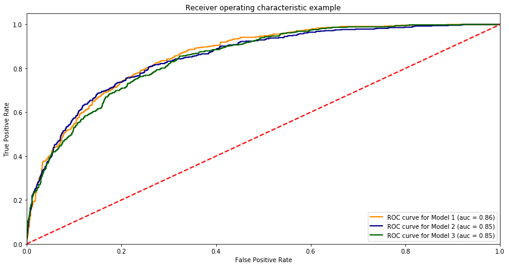

